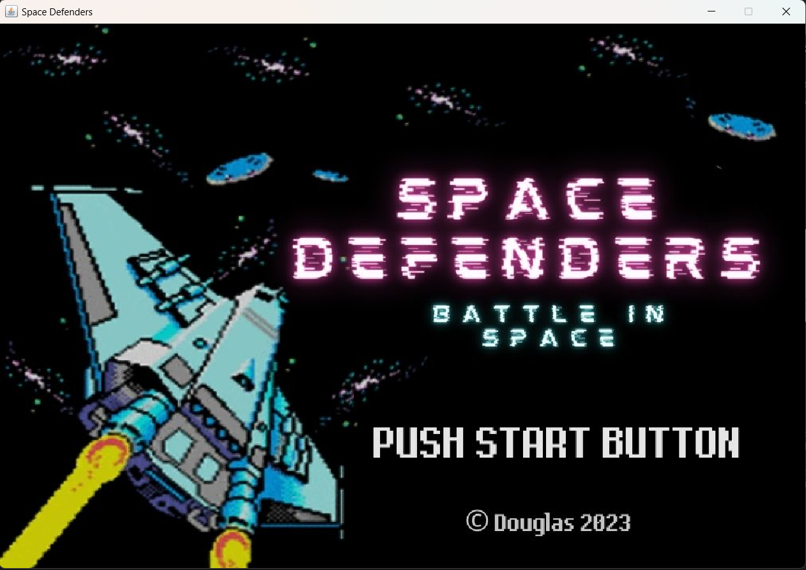
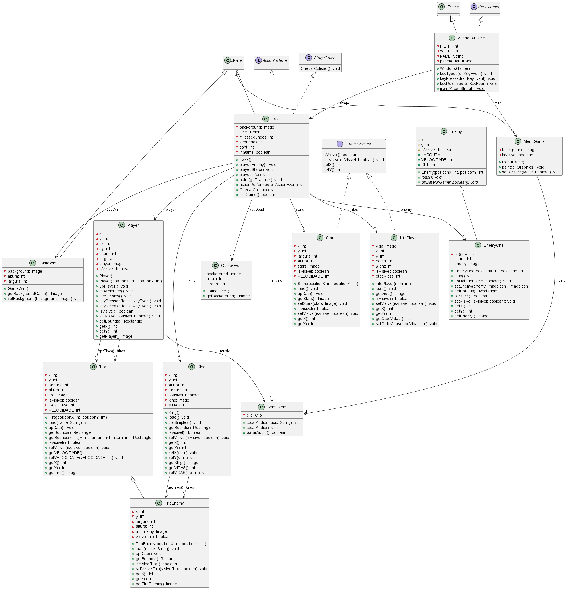
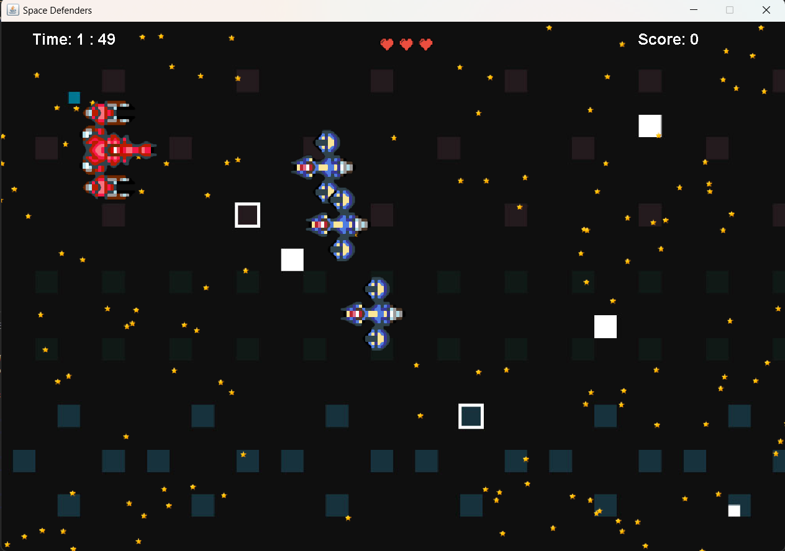
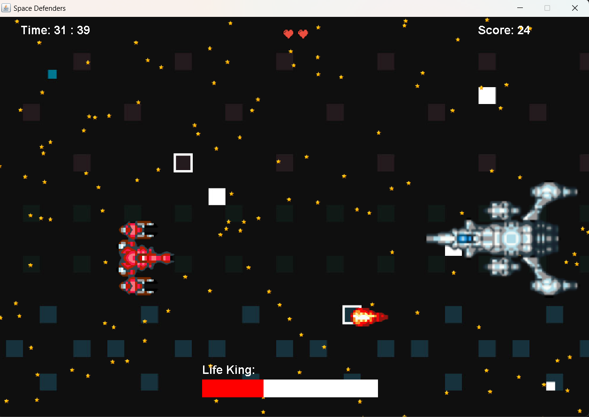
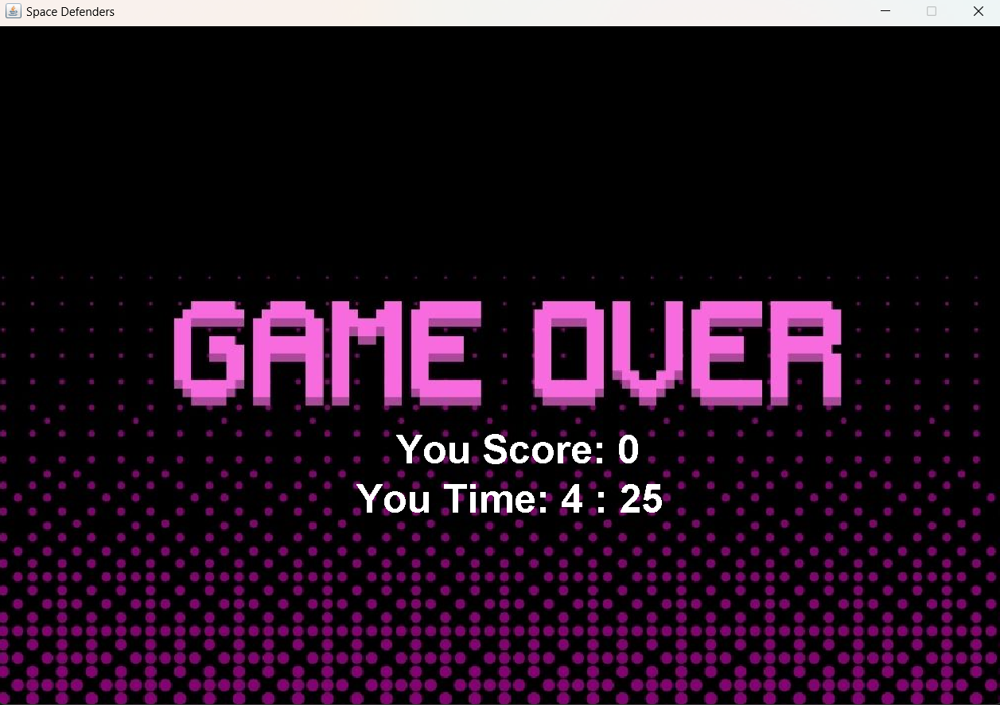
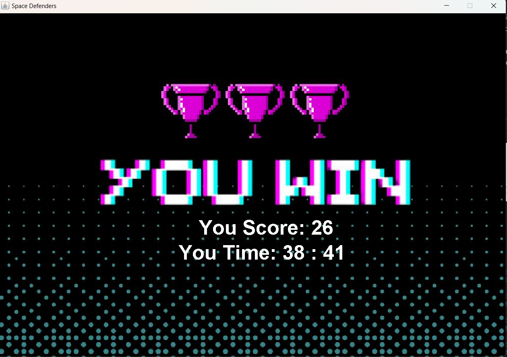

# Space Defenders Arcade - Jogo de Batalha Espacial em Java

Bem-vindo ao **Space Defenders Arcade**, um emocionante jogo de batalha espacial com estilo arcade, desenvolvido inteiramente em Java. Prepare-se para entrar em uma jornada galáctica cheia de ação, explosões e desafios intergalácticos!

## Visão Geral do Jogo

O **Space Defenders Arcade** é um jogo inspirado nos clássicos arcades de naves espaciais. Nele, você assume o papel de um piloto espacial encarregado de defender a galáxia contra hordas de inimigos alienígenas. Sua missão é simples: destruir o maior número possível de naves inimigas e sobreviver pelo maior tempo possível.

## Características Principais

- **Gráficos Espetaculares:** Desfrute de gráficos vibrantes e coloridos que recriam a atmosfera dos jogos arcade clássicos.

- **Ação Intensa:** Enfrente ondas intermináveis de inimigos que ficam cada vez mais desafiadores à medida que você avança.

- **Controles Simples:** Os controles intuitivos garantem que jogadores de todos os níveis de habilidade possam mergulhar imediatamente na batalha.

- **Trilha Sonora Cativante:** Uma trilha sonora empolgante acompanha a ação, mantendo você imerso na batalha espacial.

## Requisitos do Sistema

Certifique-se de que seu sistema atende aos requisitos mínimos para uma experiência de jogo suave:

- **Sistema Operacional:** Windows, macOS ou Linux
- **Processador:** Dual-core de 2.0 GHz ou equivalente
- **Memória:** 2 GB de RAM
- **Placa de Vídeo:** Placa compatível com OpenGL 2.1 ou superior
- **Áudio:** Placa de som compatível

## Como Jogar

1. **Download e Instalação:** Faça o download do arquivo de instalação no site oficial ou na loja de aplicativos. Execute o instalador e siga as instruções na tela para concluir a instalação.

2. **Iniciando o Jogo:** Após a instalação, execute o jogo a partir do atalho na área de trabalho ou no menu Iniciar.

3. **Controles:** Use as teclas de seta para mover sua nave e a tecla de espaço para atirar. Alguns power-ups podem alterar ou aprimorar seus controles.

4. **Objetivo:** Destrua o maior número possível de naves inimigas enquanto evita seus ataques. Sobreviva pelo maior tempo possível para alcançar a maior pontuação.

5. **Power-ups e Upgrades:** Colete power-ups para melhorar sua nave. Alguns power-ups podem aumentar a velocidade de disparo, a potência de fogo ou conceder habilidades especiais temporárias.

6. **Pontuação:** Sua pontuação é registrada e pode ser comparada com a de outros jogadores na tabela de líderes.

## Informaações sobre a aplicação:
#
### Diagrama UML:
#

#
### Imagens do Projeto:
#
### Painel Inicial:

#
### Painel de Jogo:

#

### Painel de Batalha contra o KING:

#

### Fim de Jogo:

#

### Vitória:

#